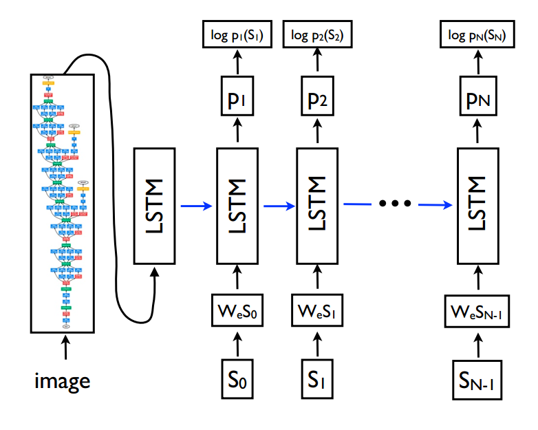

# 图片描述的生成 (Image Caption) 

## 1.使用 Keras 实现基于 LSTM 的图片描述模型

### 1.1 模型设计

从下往上依次为 : 词嵌入层, 图片嵌入层, LSTM中间层, 时序仿射输出层

 

原始图片经过预训练的 inceptionV3 的特征抽取后的图片向量再输入图片嵌入层, 图片嵌入层的输出作为 LSTM 的初始隐状态(h0)

对于数据集的预处理, 我们做了以下工作:

1. 数据批量生成器, 当数据量过大时, 受限于内存空间, 无法将全部数据喂给模型, 而是分批输入 

2. 建立包含控制词的字典 , 并且可配置词的最小出现次数(即只有大于此次数的词才会被记录到字典中)

3. 对数据集进行过滤, 去除其中的标点符号

4. 将图片标准化后, 输入到预训练的 inceptionV3 中对图片进行 embedding 

### 1.2 实验结果

详见 logs/ 下的日志

## Ref

1. Show and Tell: A Neural Image Caption Generator

2. cs231n: http://cs231n.stanford.edu/slides/2021/lecture_10.pdf (第74页 - 第87页)

3. https://github.com/yashk2810/Image-Captioning/

## Note

1.Flicker8k 数据集

数据集下载: 
https://github.com/jbrownlee/Datasets/releases/download/Flickr8k/Flickr8k_Dataset.zip
https://github.com/jbrownlee/Datasets/releases/download/Flickr8k/Flickr8k_text.zip