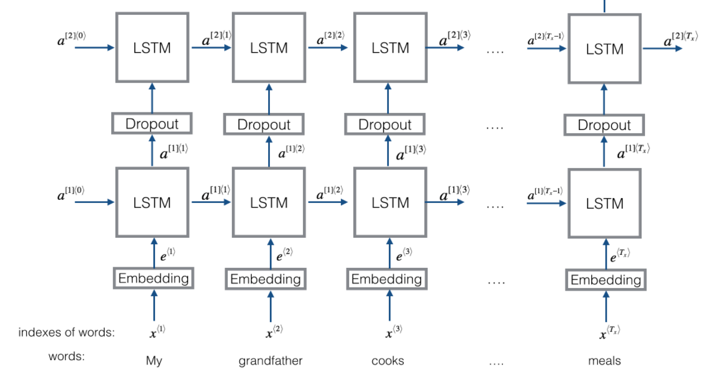

# 神经图片描述生成 (Neural Image Caption, NIC) 

 

实现了多种图片描述生成模型, 从基础的 CNN-LSTM NIC 发展到 Attention NIC

## 项目结构
    .
    ├── dataset                 # 数据集
    ├── docs                    # 参考文献
    ├── lib                     # 代码库
    ├── logs                    # 记录在不同 NIC 模型在不同数据集下的实验结果 
    ├── models                  # 预训练的模型
    ├── ref                     # 参考项目
    ├── src_bak                 # 项目的历史版本的源码
    

## 1.CNN-LSTM NIC

模型位置: [nic_cnn_lstm_xrh.py](nic_cnn_lstm_xrh.py)

### 1.1 模型设计

1. 基础模型从下往上依次为 : 词嵌入层, 图片嵌入层, LSTM中间层, 时序仿射输出层; 原始图片经过预训练的 CNN 的特征抽取后的图片向量再输入图片嵌入层, 图片嵌入层的输出作为 LSTM 的初始隐状态(h0);
此处设计参考论文(Deep Visual-Semantic Alignments for Generating Image Descriptions)

 

> 上图来自于论文(Show and Tell: A Neural Image Caption Generator), 是将图片向量作为第一个LSTM 的输入, 此处与我们的模型相比有细微的差异

2. 优化后的模型采用了 2层 LSTM 的堆叠, 并在中间使用 dropout 对 LSTM 进行连接, 模型结构类似下图

 

### 1.2 实验结果

1. 对于数据集的预处理, 我们做了以下工作:

* 数据批量生成器, 当数据量较大时, 受限于 GPU 显存空间, 将数据分批喂入模型 

* 建立包含控制词的字典 , 并且可配置词的最小出现次数(即只有大于此次数的词才会被记录到字典中)

* 对数据集进行过滤, 去除其中的非法字符和标点符号

* 将图片标准化后, 输入到预训练的 CNN 中对图片进行 embedding 

2.Flicker8k

验证集/测试集  | Bleu1 | Bleu2 | 
--------------| ------|-------|
test | 61.1 | 40.3  | 

> 按照 8:2 划分为训练集和测试集

详细实验结果: [logs/nic/nic_cnn_lstm_512_512.md](logs/nic/nic_cnn_lstm_512_512.md)

### 1.3 Ref

1. Show and Tell: A Neural Image Caption Generator
2. Deep Visual-Semantic Alignments for Generating Image Descriptions

## 2. Attention NIC

模型位置: [nic_attention_xrh.py](nic_attention_xrh.py)

### 2.1 模型设计

1. 编码器为 CNN, 解码器为 LSTM , 并添加了 soft-attention 机制 

2. 编码器的CNN 可以使用 inceptionV3 或者 VGG-16 编码的特征图作为图片的 embedding

3. 解码器的输入包括当前时间步的 attention 模块输出的上下文向量 z_t 和 上一个时间步的 token 的 embedding 向量 Ey_t-1 ;

4. 在模型训练时, 解码器采用 teacher forcing 模式; 在模型推理时, 解码器采用 autoregressive 模式

5. 实现了双重注意力机制和正则化

### 1.2 实验结果

1.Flicker8k

验证集/测试集  | Bleu1 | Bleu2 | 
--------------| ------|-------|
dev | 63.2 | 40.9  | 
test | 65.1 | 43.1  | 

> 按照 Flicker8k 数据集的默认方式划分训练, 验证和测试集

详细实验结果: [logs/nic/nic_attention_512_512.md](logs/nic/nic_attention_512_512.md)

### 1.3 Ref

1. Show, Attend and Tell: Neural Image Caption Generation with Visual Attention
2. Neural machine translation by jointly learning to align and translate

## Note

1. 相关数据集下载详见: [dataset/readme.txt](dataset/readme.txt)

2. 软件环境 [Requirements](requirements.txt)

3. 硬件资源

| CPU  | Mem | GPU | GPU-FP32 (float) |
| ------ | ----- | ----- | ----- |
| i7-7700HQ | 24GB | GTX1050(2GB)| [1.862 TFLOPS](https://www.techpowerup.com/gpu-specs/geforce-gtx-1050.c2875) |

> Google Colab:

| CPU  | Mem | GPU | GPU-FP32 (float) |
| ------ | ----- | ----- | ----- |
| - | 13GB | Tesla K80(12GB)| [4.113 TFLOPS](https://www.techpowerup.com/gpu-specs/tesla-k80.c2616) |

